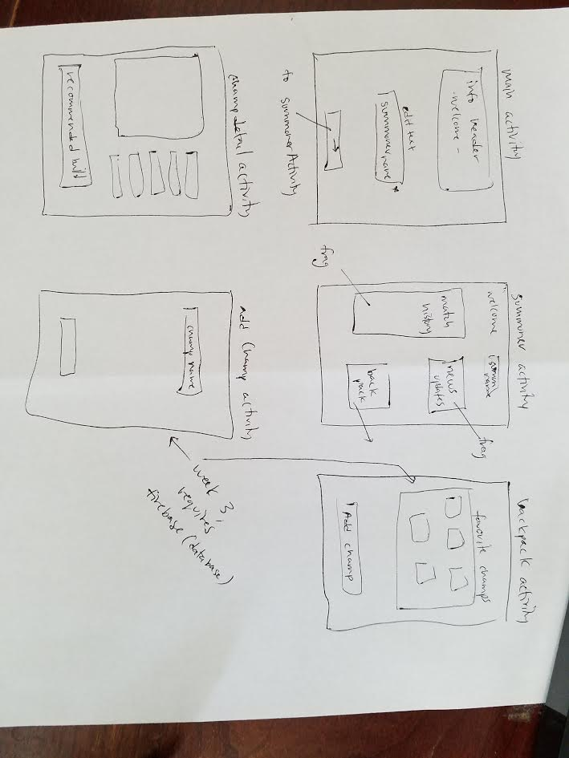

## League Stats

#### By [Riley Watts](https://www.linkedin.com/in/rileywhat) 5/28/17

## Description

A way for Summoners(users) to check their match history, add favorite champions to their backpack to look at, and eventually optimize skill/item strategies for their lane opponents.

## Setup/Installation Requirements

* If you do not yet have a League of Legends account, create one here [League of Legends Account Creation](https://signup.na.leagueoflegends.com/en/signup/index).
* After you have a League of Legends account, visit the [Riot Developer Page](https://auth.riotgames.com/authorize?redirect_uri=https://developer.riotgames.com/oauth2-callback&client_id=riot-developer-portal&response_type=code&scope=openid+email) by signing in with your League of Legends Account. Copy your API key located half-way down on the left side of the screen, you'll need it soon.
* Open your terminal/ git command line.
* Navigate to your desktop and paste `git clone https://github.com/rifley/league-stats.git`
* Open Android Studio and select the open existing project option and select 'League Stats' which should be located in the Desktop directory
* In the top level of the 'League Stats' App directory, create a new file called 'gradle.properties'
* Inside this file paste `RiotKey = "Your Key Here"` but replace "Your Key Here" with the key located on this page [Riot Developer Page](https://developer.riotgames.com/).
* You should now be able to run the application by clicking the green play button.

## Known Bugs
* When saving champion to firebase, it saves the same information multiple times under different keys. All keys are used at one point, but not during object instantiation.

## Planning

 _Week One_
- [x] Display a list of information
- [x] Use custom typefaces to enhance your designs
- [x] Gather user input and pass it to another activity
- [x] Validate all forms
- [x] Use ButterKnife to bind all views.
- [x] Implement the View.OnClickListener interface to set click listeners to view elements

_Week Two_
- [x] Implement OkHttp to retrieve data from a backend.
- [x] Create a data model to store the data.
- [x] Display a list of information using a RecyclerView
- [x] Incorporate at least one implicit intent

_Week Three_

- [x] Implement Firebase user authentication.
- [ ] Save and retrieve data using Firebase, making sure to structure your data according to Firebase guidelines.
- [ ] Employ the Firebase-RecyclerAdapter to display from your database.
- [x] Use SharedPreferences to save an important piece of data in your app.
- [x] Utilize dialogs to inform users of login status

## Support and contact details
If you have any questions, concerns, or general comments, reach out to me via email or InMail on LinkedIn

_[email](mailto:watts.up.riley@gmail.com) - [github](https://www.github.com/rifley) -
[linkedIn](https://www.linkedin.com/in/rileywhat)_

## Technologies Used

Android Studio - Java

### License

MIT License

Copyright (c) 2017 - Riley Watts
