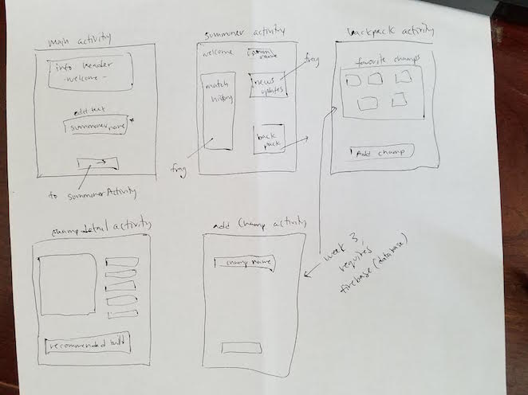

## League Stats

#### By [Riley Watts](https://www.linkedin.com/in/rileywhat) 5/28/17

## Description

A way for Summoners(users) to check their match history, add favorite champions to their backpack to look at, and eventually optimize skill/item strategies for their lane opponents.

## Setup/Installation Requirements

* `Clone this repository to your local machine`

* `Open with Android Studio`
* `Run the Main Activity`

## Known Bugs
_TBD_

## Planning

 _Week One_
- [x] Display a list of information
- [x] Use custom typefaces to enhance your designs
- [x] Gather user input and pass it to another activity
- [x] Validate all forms
- [x] Use ButterKnife to bind all views.
- [x] Implement the View.OnClickListener interface to set click listeners to view elements

_Week Two_
- [x] Implement OkHttp to retrieve data from a backend.
- [x] Create a data model to store the data.
- [ ] Display a list of information using a RecyclerView
- [ ] Use fragments and a PagerAdapter to swipe through views
- [ ] Incorporate at least one implicit intent

## Support and contact details
If you have any questions, concerns, or general comments, reach out to me via email or InMail on LinkedIn

_[email](mailto:watts.up.riley@gmail.com) - [github](https://www.github.com/rifley) -
[linkedIn](https://www.linkedin.com/in/rileywhat)_

## Technologies Used

Android Studio - Java

### License

MIT License

Copyright (c) 2017 - Riley Watts
